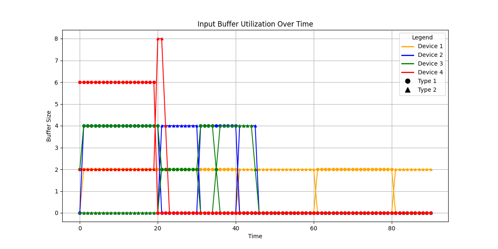
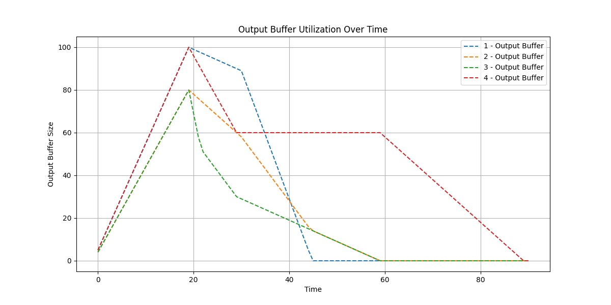
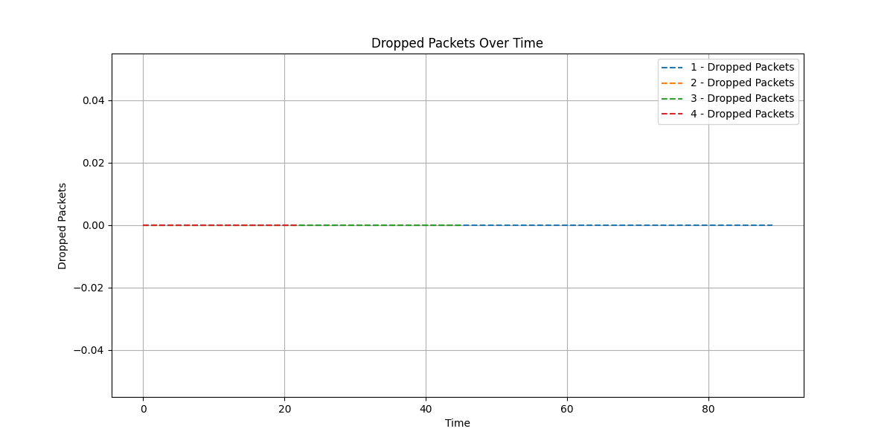

# Credit-based Control Flow Switching

### The `Interface Circuits Design` course midterm

Sharif University of Technology - Fall 2024

---

+ **Mehrad Milanloo**

    + **Student ID**: 991005775

    + **Email**: milanloomehrad@gmail.com

---

## Running the Simulator

To run the simulator, follow these steps:

1. Download and extract the project files into a directory.

2. Execute the main simulation script by running:
   ```
   python main.py
   ```

## Modifying Configurations

The simulation parameters can be customized using the `config.json` file located in the `config` directory. This file contains:

- **Devices**: Defines the devices, their buffer capacities, processing rates, and send rates.

- **Switches**: Specifies the switch ID and the devices connected to it.

- **Packets**: Specifies the packet types, priorities, sizes, and frequencies.

To modify a parameter, edit the respective values in `config.json`. For example, to change the buffer capacity of a device, update the `buffer_capacity` field for that device.

## Simulation and Cooling Phases

The simulation runs in two phases:

1. **Simulation Phase**:

   - Devices generate packets and send them to their respective destinations through the switch.

   - Packets are processed based on their priorities.

   - Devices dynamically manage their buffers and credits.

2. **Cooling Phase**:
 
   - After packet generation is complete, the cooling phase ensures that all packets in the buffers are delivered to their destinations.
 
   - The simulation concludes when no packets remain in any buffer.

## Code Modules

1. **`device.py`**:
  
   - Handles device functionalities such as generating, sending, and processing packets.
  
   - Tracks buffer utilization and retransmissions.

2. **`switch.py`**:
 
   - Manages the connections between devices and forwards packets.
 
   - Dynamically initializes and adjusts credits for devices.

3. **`packet.py`**:
 
   - Defines the packet structure, including type, size, priority, and source/destination information.

4. **`main.py`**:

   - Runs the simulation and cooling phases.

   - Plots results for buffer utilization, output buffer size, and dropped packets.

5. **`config.json`**:
  
   - Provides configuration for devices, switches, and packets.

## Implementation of Key Questions

### Question 1: Dynamic Credit Management

- **Implementation**: Credits are distributed dynamically based on receive rates. Devices negotiate send rates before transmission, and credits are adjusted dynamically as packets are processed.

### Question 2: Prioritizing Packets by Type

- **Implementation**: Buffers track packets separately by type. The `track_buffer` method maintains a count for each packet type. During processing, higher-priority packets are processed first, but lower-priority packets are not entirely neglected.

- **Visualization**: Input buffer utilization is plotted with separate lines for each packet type, demonstrating how high-priority packets are given precedence while low-priority packets also get processed over time.

## Real-World Protocol: 

### Protocol Steps:

1. **Negotiation Phase**:

   - Before sending packets, devices exchange messages to agree on send rates.

   - The sender informs the receiver of its intended send rate.

   - The receiver calculates its available buffer capacity and allocates credits to the sender accordingly.

2. **Credit Distribution**:

   - The receiver informs the sender of the allocated credits in its response.

   - These credits represent the maximum number of packets the sender can transmit at a time.

3. **Dynamic Adjustment**:

   - As packets are processed by the receiver, it dynamically returns credits to the sender.

   - This ensures that credits are continuously balanced between active senders.

4. **Cooling Phase Balancing**:

   - When a sender completes its transmissions, its unused credits are redistributed among other active senders.

   - This prevents any credit wastage and ensures efficient utilization of resources.

### Key Strengths:

- **Efficiency**: No packets are dropped, as seen in the final plot, demonstrating the effectiveness of the algorithm.

- **Dynamic Balancing**: Credits are redistributed dynamically, ensuring efficient utilization even when senders become inactive.

- **Robustness**: The implementation is parameterized, allowing easy adaptation to real-world scenarios by modifying configurations in `config.json`.

## Plots Explanation

1. **Input Buffer Utilization**:

   - Shows buffer occupancy for each device, separated by packet types.

   - Demonstrates the prioritization mechanism where higher-priority packets are processed faster.

    
    <!--  -->

2. **Output Buffer Utilization**:

   - Tracks the total size of output buffers over time.

   - Highlights how packets are dequeued and forwarded efficiently.

    
    <!--  -->

3. **Dropped Packets**:

   - Indicates the number of dropped packets over time.

   - In this implementation, no packets are dropped, showcasing the robustness of the credit management algorithm.

    
    <!--  -->